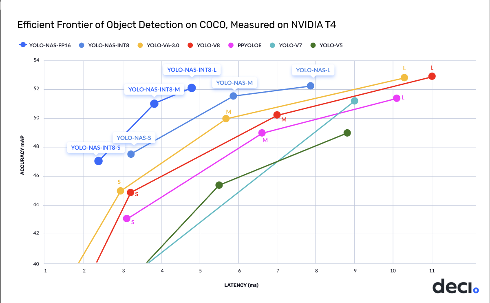
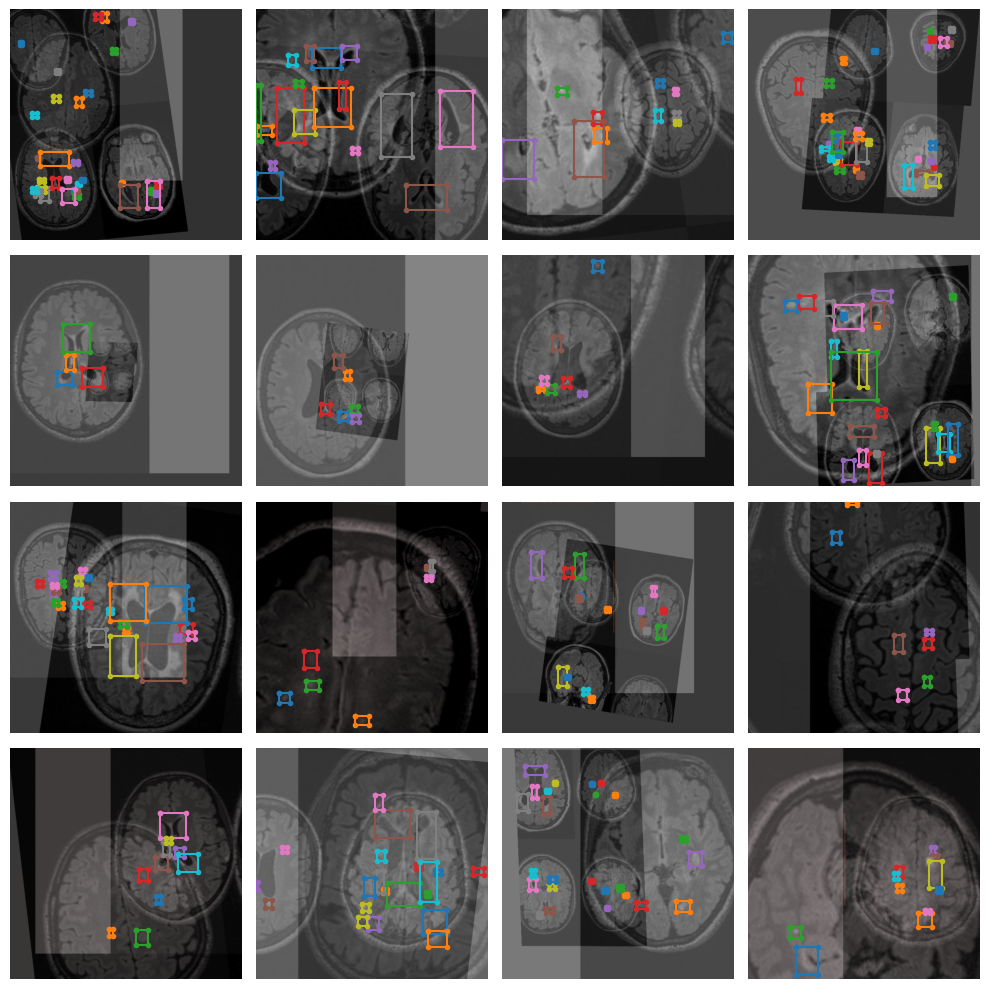
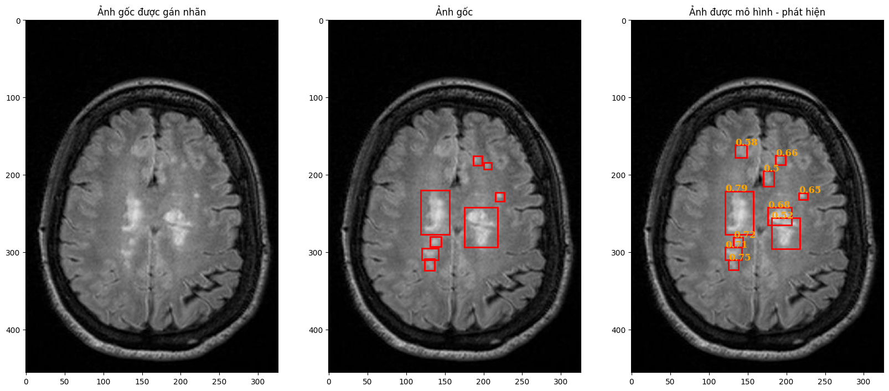

<html>

<h3><b> Disease Region Detection using YOLO-NAS Model </h3></b>
  
<body>
    
</body>

<h3><b> Data Augmentation </h3></b>

<body>
    
</body>
</html>

<!DOCTYPE html>
<html>
<head>

</head>
<body>

  <h2>Detection Results</h2>

  <table>
    <tr>
      <th>Metric</th>
      <th>Value</th>
    </tr>
    <tr>
      <td>Recall@0.50</td>
      <td>0.9591</td>
    </tr>
    <tr>
      <td>mAP@0.50</td>
      <td>0.7099</td>
    </tr>
  </table>

</body>
</html>

<html>
<h3><b> Results Image </h3></b>
<body>
    
</body>

</html>
